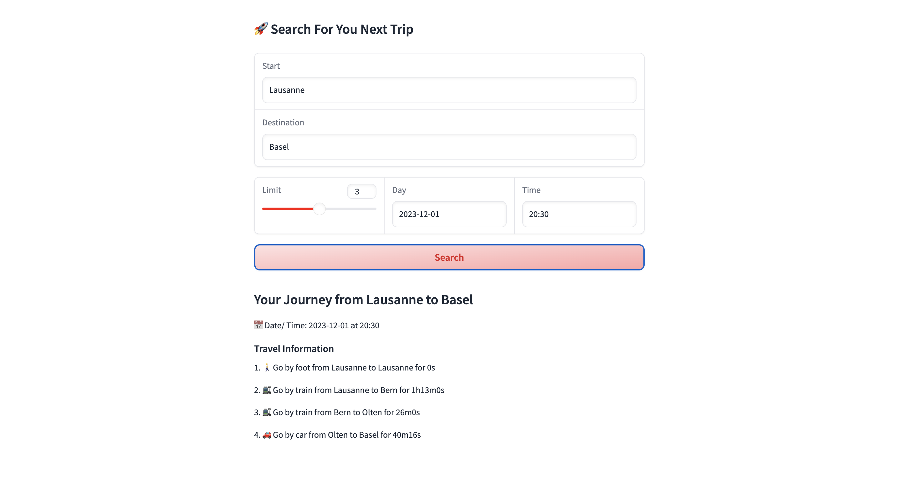

## Lauzhack 2023

SBB is a leading Swiss mobility provider with around 34,000 employees and 1,900 train drivers which ensures that around 1.25 million passengers reach their destination safely and on time every day. In this project, we focus on coming up with a prototype of a routing engine that can take into account mutliple modalities of transportation and provide the best route for the user.

## Approach

We have used the following approach to solve the problem:

1. We have used the SBB Open Data Platform to build our graph where nodes are the train stations and edges are the possible train connections. Each edge is associated with attributes including departure and arrival time, duration as well as position of both stations. We then enriched this graph with possible car as well as biking connections where we used a simple proxy of average walking / biking speed and distance between stations to calculate the duration of the connection.

2. We then used the graph to build a routing engine that can take into account multiple modalities of transportation. We then used a custom Dijkstra algorithm to find the shortest path between two nodes.

3. Finally, we put together a demo to try our new routing engine which can be fine [here](https://huggingface.co/spaces/ludekcizinsky/lauzhack).
